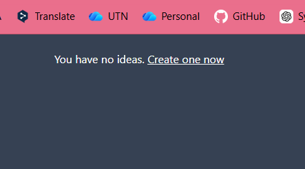
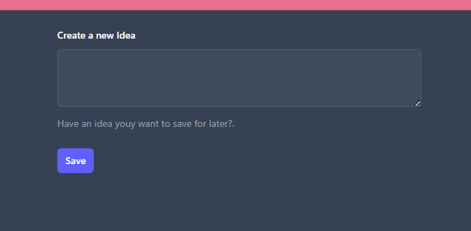
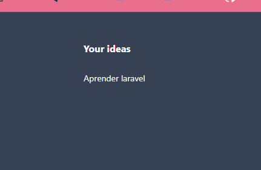
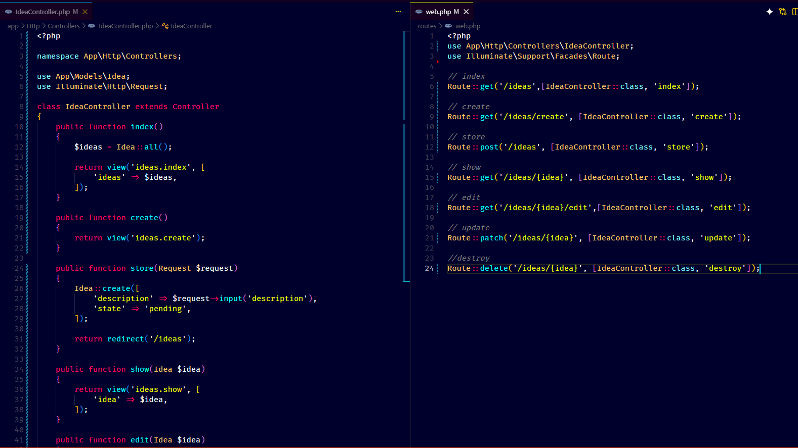

# Controllers

## Episodio 10 - Controllers

### Desarrollo del episodio

En este episodio se completó la implementación de las acciones RESTful para el recurso **Ideas**. Se creó una vista independiente para mostrar el formulario de creación de nuevas ideas mediante la acción `create()`, permitiendo separar esta funcionalidad de la vista principal.

Además, se introdujo el uso de controladores para organizar mejor el código de la aplicación. Se creó el controlador `IdeaController`, donde se centralizaron todas las acciones relacionadas con las ideas, reemplazando la lógica que anteriormente se encontraba directamente en las rutas.

Las acciones RESTful implementadas fueron:

- `index()` → Mostrar todas las ideas.
- `create()` → Mostrar el formulario para crear una idea.
- `store()` → Guardar una nueva idea en la base de datos.
- `show()` → Mostrar una idea específica.
- `edit()` → Mostrar el formulario de edición.
- `update()` → Actualizar una idea existente.
- `destroy()` → Eliminar una idea.

También se agregó un mensaje para informar al usuario cuando no existen ideas registradas y un enlace para crear una nueva.

## Comandos utilizados

```bash
php artisan make:controller IdeaController --resource --model=Idea
```

## Archivos modificados

- app/Http/Controllers/IdeaController.php
- routes/web.php
- resources/views/ideas/index.blade.php
- resources/views/ideas/create.blade.php

## Cambios realizados

- Se creó el controlador `IdeaController`.
- Se trasladó la lógica de las rutas al controlador.
- Se creó la vista `create.blade.php`.
- Se movió el formulario de creación fuera de la vista principal.
- Se implementaron las siete acciones RESTful del recurso Ideas.
- Se agregó un mensaje cuando no existen ideas registradas.
- Se agregó un enlace para acceder al formulario de creación de ideas.

## Evidencias

### Sin ideas registradas

Cuando la base de datos no contiene registros, se muestra un mensaje indicando que no existen ideas y un enlace para crear una nueva.



### Formulario para crear una nueva idea

Vista independiente que permite ingresar una nueva idea y enviarla al método `store()`.



### Idea registrada correctamente

Después de guardar una idea, esta aparece en el listado principal.



### Implementación del controlador y rutas RESTful

Se observa la creación del controlador `IdeaController` y la configuración de las rutas para cada acción RESTful.


