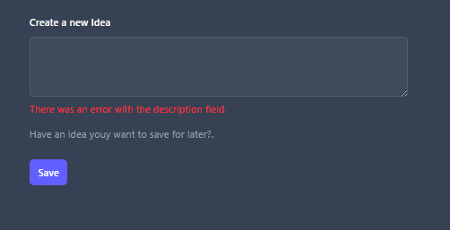
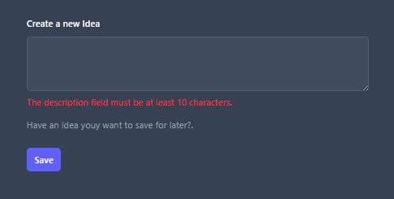

# Request Validation

## Episodio 11: Request Validation

### Desarrollo del episodio

En este episodio aprendí a validar los datos enviados desde formularios antes de almacenarlos en la base de datos. Laravel permite realizar validaciones de forma sencilla mediante el método `validate()`, evitando que información inválida llegue a la aplicación.

Anteriormente era posible enviar el formulario vacío, provocando un error cuando Laravel intentaba guardar el registro en la base de datos. Con la validación, el sistema verifica primero que los datos cumplan ciertas reglas antes de ejecutar cualquier consulta.

---

## Validación implementada

Se agregó validación al método `store()` del controlador para el campo `description`.

```php
public function store(Request $request)
{
    $validated = $request->validate([
        'description' => 'required|min:10',
    ]);

    Idea::create([
        'description' => $validated['description'],
        'state' => 'pending',
    ]);

    return redirect('/ideas');
}
```

### Reglas utilizadas

| Regla | Descripción |
|---------|------------|
| required | El campo es obligatorio |
| min:10 | Debe contener al menos 10 caracteres |

---

## Mostrar errores de validación

Laravel almacena temporalmente los errores y los pone a disposición de la vista mediante el objeto `$errors`.

Para mostrar el mensaje de error debajo del campo se utilizó la directiva `@error`:

```php
@error('description')
    <p class="mt-2 text-sm text-red-500">
        {{ $message }}
    </p>
@enderror
```

Cuando la validación falla, Laravel redirige automáticamente al usuario al formulario y muestra el mensaje correspondiente.

---

## Archivos modificados

- `app/Http/Controllers/IdeaController.php`
- `resources/views/ideas/create.blade.php`

---

## Evidencias

### Error cuando la descripción está vacía



### Error cuando la descripción tiene menos de 10 caracteres



---
