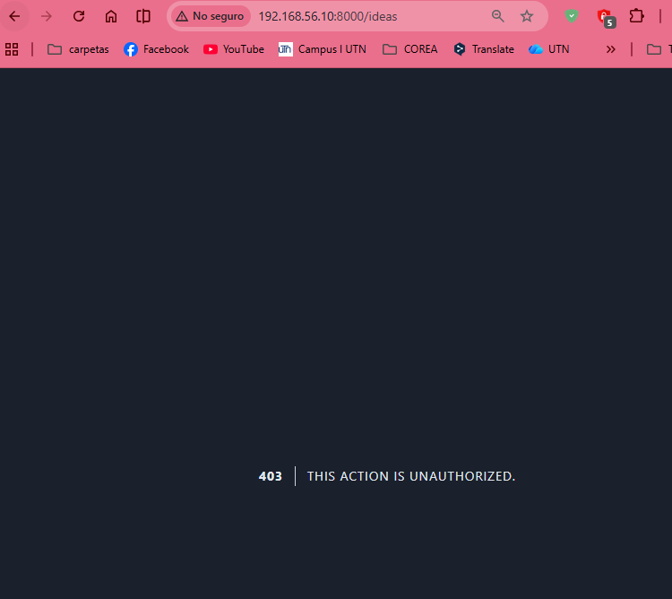

# Form Request Classes

## Episodio 12: Form Request Classes

### Desarrollo del episodio

En este episodio aprendí a utilizar las **Form Request Classes** de Laravel para separar la lógica de validación de los controladores. Esto permite mantener el código más limpio, organizado y fácil de mantener.

Laravel permite generar una clase especializada para manejar validaciones y autorizaciones de solicitudes HTTP. De esta forma, el controlador únicamente se encarga de procesar los datos y ejecutar la lógica de negocio.

También se explicó que usar Form Request no es necesariamente mejor que validar directamente en el controlador; simplemente es una alternativa útil cuando se requiere una mejor organización del proyecto. 

---

## Comando utilizado

```bash
php artisan make:request StoreIdeaRequest
```

Este comando crea una nueva clase dentro de:

```text
app/Http/Requests/
```

---

## Clase de Solicitud

Laravel genera una estructura similar a la siguiente:

```php
<?php

namespace App\Http\Requests;

use Illuminate\Foundation\Http\FormRequest;

class StoreIdeaRequest extends FormRequest
{
    public function authorize(): bool
    {
        return true;
    }

    public function rules(): array
    {
        return [
            'description' => 'required|min:3'
        ];
    }
}
```

---

## Autorización

El método `authorize()` determina si el usuario tiene permiso para realizar la solicitud.

```php
public function authorize(): bool
{
    return true;
}
```

Si retorna `false`, Laravel bloquea automáticamente la solicitud y muestra un error **403 Unauthorized**. :contentReference[oaicite:2]{index=2}

---

## Reglas de Validación

Las reglas se definen dentro del método `rules()`.

```php
public function rules(): array
{
    return [
        'description' => 'required|min:3'
    ];
}
```

Estas reglas son exactamente las mismas que se utilizaban anteriormente dentro del controlador. :contentReference[oaicite:3]{index=3}

---

## Uso en el Controlador

Antes:

```php
public function store(Request $request)
{
    $request->validate([
        'description' => 'required|min:3'
    ]);
}
```

Después:

```php
use App\Http\Requests\StoreIdeaRequest;

public function store(StoreIdeaRequest $request)
{
    Idea::create([
        'description' => $request->input('description'),
        'state' => 'pending'
    ]);
}
```

Laravel ejecuta automáticamente la validación antes de ingresar al método del controlador. :contentReference[oaicite:4]{index=4}

---

## Personalización de Mensajes

Es posible personalizar los mensajes de error mediante el método `messages()`.

```php
public function messages()
{
    return [
        'description.required' => 'Por favor ingrese una descripción.'
    ];
}
```

También se pueden utilizar atributos dinámicos:

```php
public function messages()
{
    return [
        'description.required' => 'Debe ingresar un valor para :attribute'
    ];
}
```

:contentReference[oaicite:5]{index=5}

---

## Reutilización de Validaciones

Si las reglas para crear y actualizar registros son iguales, se puede utilizar una sola clase de solicitud.

Por ejemplo:

```php
class IdeaRequest extends FormRequest
{
    public function rules(): array
    {
        return [
            'description' => 'required|min:3'
        ];
    }
}
```

Y utilizarla tanto en:

```php
public function store(IdeaRequest $request)
```

como en:

```php
public function update(IdeaRequest $request, Idea $idea)
```

Si las validaciones son diferentes, es recomendable crear clases separadas como:

```text
StoreIdeaRequest
UpdateIdeaRequest
```

:contentReference[oaicite:6]{index=6}

---

## Archivos Modificados

```text
app/Http/Requests/StoreIdeaRequest.php
app/Http/Controllers/IdeaController.php
resources/views/ideas/create.blade.php
resources/views/ideas/edit.blade.php
```

---

## Evidencias

### Error 403 al retornar false en authorize()



---
