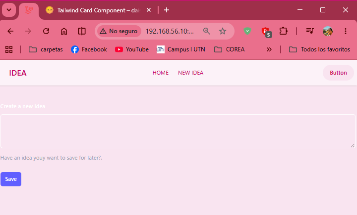
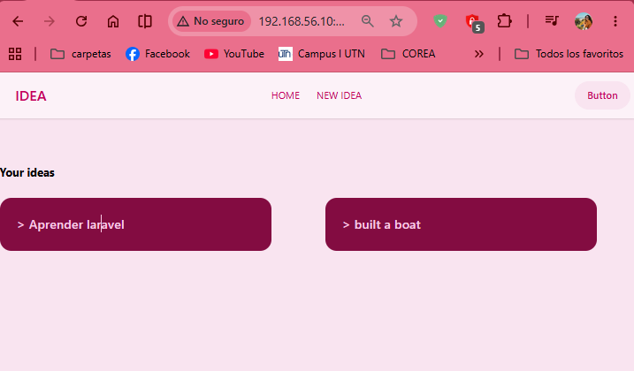

# A Brief DaisyUI Detour

## Episodio 13: A Brief DaisyUI Detour

### Desarrollo del episodio

En este episodio se mejoró la apariencia visual de la aplicación utilizando **DaisyUI**, una biblioteca de componentes construida sobre Tailwind CSS. Se incorporó DaisyUI mediante CDN para aprovechar componentes prediseñados como barras de navegación, botones, formularios y tarjetas.

También se reorganizó la interfaz utilizando componentes Blade reutilizables, permitiendo mantener un código más limpio y fácil de mantener. Además, se exploró el uso de temas personalizados para cambiar rápidamente la apariencia de la aplicación.

La sección de ideas fue rediseñada utilizando tarjetas visuales, mejorando significativamente la presentación de la información almacenada en la base de datos.

## Conceptos aprendidos

- Integración de DaisyUI con Tailwind CSS.
- Uso de componentes prediseñados para acelerar el desarrollo.
- Creación de una barra de navegación moderna.
- Implementación de tarjetas para mostrar información.
- Creación de componentes Blade reutilizables.
- Uso de slots y atributos en componentes Blade.
- Aplicación de temas visuales personalizados.
- Mejora visual de formularios y botones.
- Personalización de estilos de validación.

## Archivos modificados

- `resources/views/components/nav.blade.php`
- `resources/views/components/idea-card.blade.php`
- `resources/views/components/layout.blade.php`
- `resources/views/ideas/index.blade.php`
- `resources/views/ideas/create.blade.php`
- `resources/views/ideas/show.blade.php`
- `resources/views/ideas/edit.blade.php`

## Código destacado

### Navbar utilizando DaisyUI

```html
<nav class="navbar bg-base-100">
    <div class="flex-1">
        <a class="btn btn-ghost text-xl">IDEA</a>
    </div>

    <div class="flex-none">
        <ul class="menu menu-horizontal px-1">
            <li><a href="/ideas">Home</a></li>
            <li><a href="/ideas/create">New Idea</a></li>
        </ul>
    </div>
</nav>
```

### Componente reutilizable para tarjetas

```blade
<a {{ $attributes->merge([
    'class' => 'card bg-neutral text-neutral-content'
]) }}>
    <div class="card-body">
        {{ $slot }}
    </div>
</a>
```

### Aplicación de tema personalizado

```html
<html data-theme="valentine">
```

## Evidencias

### Formulario para crear una nueva idea utilizando DaisyUI



En esta evidencia se observa el formulario para registrar nuevas ideas utilizando componentes visuales de DaisyUI. Se aplicó el tema **Valentine**, mejorando la apariencia de los campos de texto y botones.

### Listado de ideas mostrado mediante tarjetas reutilizables



En esta evidencia se muestra el listado de ideas utilizando tarjetas reutilizables creadas mediante componentes Blade. Cada idea se presenta dentro de una tarjeta estilizada con DaisyUI, logrando una interfaz más limpia y moderna.

