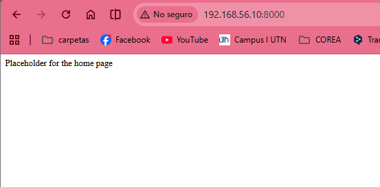
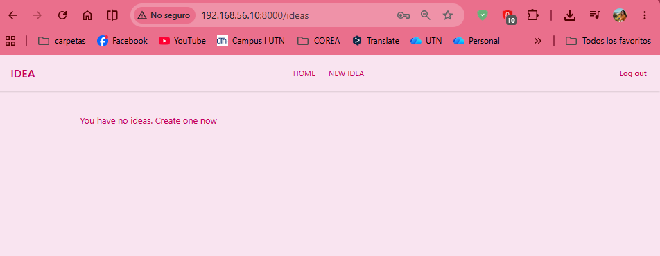
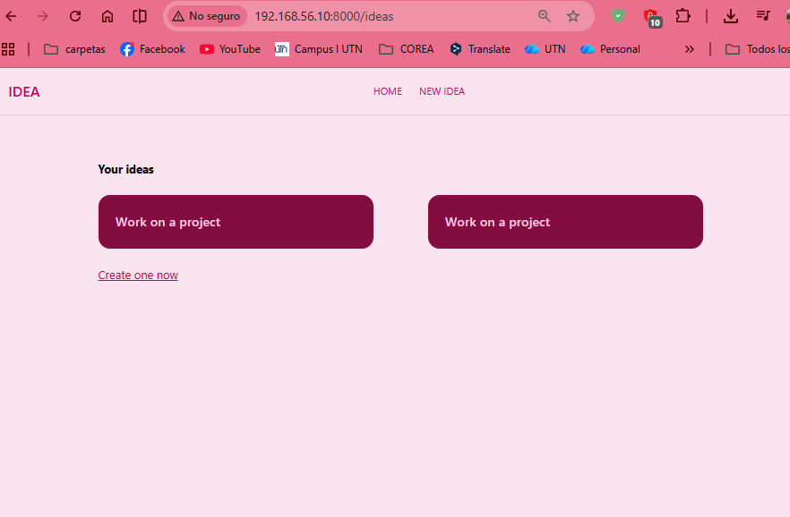

# Require Authentication With Middleware

## Episodio 15 – Require Authentication With Middleware

### Desarrollo del episodio

En este episodio se implementa la protección de rutas mediante **Middleware** y se establece la relación entre las ideas y los usuarios autenticados. Hasta este punto, las ideas únicamente almacenaban una descripción, pero ahora cada registro queda asociado al usuario que la creó.

Para lograrlo, se modifica la migración de la tabla `ideas`, agregando una llave foránea (`user_id`) que referencia la tabla `users`. Además, se configura la eliminación en cascada (`cascadeOnDelete()`), de manera que si un usuario es eliminado, todas sus ideas también se eliminen automáticamente, evitando registros huérfanos en la base de datos.

Una vez modificada la migración, se utiliza el comando:

```bash
php artisan migrate:fresh
```

Este comando elimina todas las tablas y vuelve a ejecutar las migraciones desde cero, creando nuevamente la estructura de la base de datos.

---

## Protección de rutas con Middleware

Laravel incorpora el middleware **auth**, el cual restringe el acceso a determinadas rutas para que únicamente los usuarios autenticados puedan utilizarlas.

En lugar de proteger cada ruta individualmente, Laravel permite agruparlas utilizando `Route::middleware()`, haciendo el código mucho más limpio y fácil de mantener.

```php
Route::middleware('auth')->group(function () {
    Route::resource('ideas', IdeaController::class);
});
```

Con esta configuración, solamente los usuarios que hayan iniciado sesión podrán:

- Ver sus ideas.
- Crear nuevas ideas.
- Editar ideas.
- Actualizar información.
- Eliminar registros.

Si un usuario intenta acceder sin autenticarse, Laravel lo redireccionará automáticamente a la página de inicio de sesión.

---

## Middleware para visitantes (guest)

Además del middleware `auth`, Laravel proporciona el middleware **guest**, el cual funciona de manera inversa.

Este middleware permite que únicamente los usuarios **no autenticados** puedan acceder a páginas como:

- Registro.
- Inicio de sesión.

Si un usuario ya inició sesión e intenta acceder nuevamente al formulario de registro o login, Laravel puede redireccionarlo automáticamente a otra página, por ejemplo:

```php
Route::middleware('guest')->group(function () {
    Route::get('/register', ...);
    Route::get('/login', ...);
});
```

Esto mejora la experiencia del usuario y evita accesos innecesarios.

---

## Asociación de ideas con el usuario autenticado

Como ahora cada idea pertenece a un usuario, al momento de almacenarla es necesario guardar el identificador del usuario que inició sesión.

Laravel proporciona la fachada `Auth`, que permite obtener fácilmente el usuario autenticado.

```php
Idea::create([
    'description' => $request->description,
    'state' => 'pending',
    'user_id' => Auth::id(),
]);
```

También puede obtenerse el objeto completo del usuario mediante:

```php
Auth::user();
```

Debido a que la ruta está protegida por el middleware `auth`, siempre existe un usuario autenticado y `Auth::id()` nunca será `null`.

---

## Filtrado de ideas por usuario

Anteriormente el controlador recuperaba todas las ideas almacenadas en la base de datos:

```php
$ideas = Idea::all();
```

Esto ocasionaba que cualquier usuario pudiera visualizar ideas creadas por otros.

Para solucionar el problema, se filtran únicamente las ideas cuyo `user_id` corresponde al usuario autenticado.

```php
$ideas = Idea::query()
    ->where('user_id', Auth::id())
    ->get();
```

Con esta consulta:

- Cada usuario únicamente visualiza sus propias ideas.
- Las ideas permanecen privadas.
- Se mejora la seguridad de la aplicación.

---

## Rutas con nombre (Named Routes)

Jeffrey también explica el concepto de **Named Routes**.

Una ruta con nombre permite referenciar una ruta mediante un identificador en lugar de escribir directamente la URL.

```php
Route::get('/login', ...)
    ->name('login');
```

Laravel utiliza automáticamente el nombre `login` cuando necesita redireccionar usuarios que no han iniciado sesión.

Aunque el instructor menciona que normalmente prefiere trabajar utilizando directamente las URLs, conocer las rutas con nombre es importante porque Laravel las utiliza internamente en muchos componentes del framework.

---

## Configuración de redirecciones

Dentro del archivo:

```
bootstrap/app.php
```

es posible personalizar las redirecciones que realizan los middlewares.

Por ejemplo:

- Redirigir usuarios invitados hacia `/login`.
- Redirigir usuarios autenticados hacia `/ideas`.

Esto permite adaptar el comportamiento de la aplicación según las necesidades del proyecto.

---

## Conceptos aprendidos

Durante este episodio se trabajó con los siguientes conceptos de Laravel:

- Middleware `auth`.
- Middleware `guest`.
- Agrupación de rutas mediante middleware.
- Llaves foráneas (`foreignId`).
- Restricciones (`constrained()`).
- Eliminación en cascada (`cascadeOnDelete()`).
- Asociación entre usuarios e ideas.
- Obtención del usuario autenticado con `Auth::id()` y `Auth::user()`.
- Filtrado de registros utilizando `where()`.
- Rutas con nombre (`Named Routes`).
- Reinicio completo de migraciones mediante `php artisan migrate:fresh`.

---

## Fragmentos de código importantes

### Relación entre ideas y usuarios en la migración

```php
$table->foreignIdFor(User::class)
      ->constrained()
      ->cascadeOnDelete();
```

---

### Protección de rutas

```php
Route::middleware('auth')->group(function () {
    Route::resource('ideas', IdeaController::class);
});
```

---

### Middleware para visitantes

```php
Route::middleware('guest')->group(function () {
    Route::get('/register', ...);
    Route::get('/login', ...);
});
```

---

### Guardar una idea asociada al usuario autenticado

```php
Idea::create([
    'description' => $request->description,
    'state' => 'pending',
    'user_id' => Auth::id(),
]);
```

---

### Obtener únicamente las ideas del usuario autenticado

```php
$ideas = Idea::query()
    ->where('user_id', Auth::id())
    ->get();
```

---

## Evidencias

### Redirección al intentar acceder a una ruta de invitado estando autenticado



---

### Usuario autenticado sin ideas registradas



---

### Ideas asociadas al usuario autenticado



---
