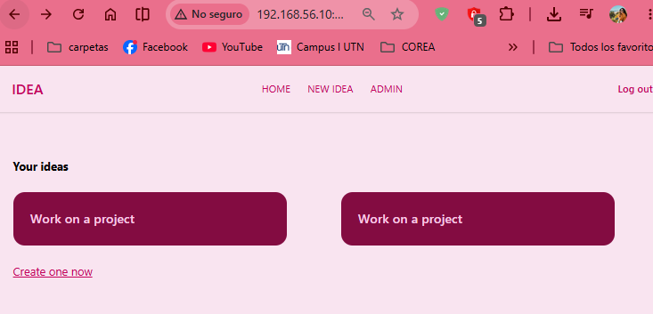
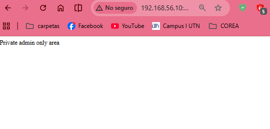

# Authorization Using Gates

## Episodio 17: Authorization Using Gates

### Desarrollo del episodio

En este episodio se introduce el sistema de autorización de Laravel mediante **Gates**, el cual permite controlar qué acciones puede realizar un usuario autenticado dentro de la aplicación.

Como ejemplo, se agrega un enlace hacia una sección de administración (`/admin`). Inicialmente cualquier usuario puede acceder a esta ruta, por lo que se implementa una regla de autorización para restringir su acceso.

### Definición de un Gate

Las reglas de autorización se registran dentro de `AppServiceProvider` utilizando la fachada `Gate`. Cada Gate recibe el usuario autenticado y debe devolver un valor booleano indicando si posee o no el permiso requerido.

```php
Gate::define('view-admin', function (User $user) {
    return $user->id === 1;
});
```

En este ejemplo únicamente el usuario con ID igual a `1` es considerado administrador.

---

### Uso de la directiva `@can`

Una vez definido el Gate, Laravel permite utilizar la directiva Blade `@can` para mostrar u ocultar contenido dependiendo de la autorización del usuario.

```blade
@can('view-admin')
    <a href="/admin">Admin</a>
@endcan
```

Esta directiva ejecuta automáticamente la regla definida en el Gate y solo renderiza el contenido cuando la autorización es válida.

---

### Protección de rutas

Además de ocultar enlaces en las vistas, también es necesario proteger la ruta para evitar que un usuario escriba manualmente la URL.

Laravel permite hacerlo mediante el middleware `can`.

```php
Route::get('/admin', function () {
    return 'Private admin area';
})->can('view-admin');
```

Cuando el usuario no cumple la condición del Gate, Laravel devuelve automáticamente un error **403 Forbidden**.

---

### Autorización dentro de la ruta o controlador

Otra alternativa consiste en realizar la validación directamente dentro del controlador o del closure utilizando `Gate::authorize()`.

```php
Gate::authorize('view-admin');
```

Si el usuario no está autorizado, Laravel lanza una excepción que genera automáticamente la respuesta HTTP correspondiente.

---

### Personalización de la respuesta

En lugar de devolver únicamente un valor booleano, un Gate también puede retornar una instancia de `Illuminate\Auth\Access\Response`.

```php
return Response::allow();
```

o

```php
return Response::denyAsNotFound();
```

Con `denyAsNotFound()` Laravel responde con un **404 Not Found** en lugar de un **403 Forbidden**, ocultando la existencia de la ruta protegida.

---

### Organización de la lógica de autorización

Jeffrey recomienda mantener la lógica de autorización lo más sencilla posible. Para proyectos pequeños puede bastar con comprobar el ID del usuario:

```php
return $user->id === 1;
```

En aplicaciones más completas resulta más conveniente agregar un campo `role` a la tabla de usuarios y encapsular la lógica en un método del modelo.

```php
public function isAdmin()
{
    return $this->role === 'admin';
}
```

Posteriormente el Gate puede utilizar este método:

```php
return $user->isAdmin();
```

Esto hace que el código sea más limpio y fácil de mantener.

## Conceptos aprendidos

- Implementación de autorización utilizando **Laravel Gates**.
- Registro de Gates dentro de `AppServiceProvider`.
- Uso de la fachada `Gate`.
- Renderizado condicional con la directiva `@can`.
- Protección de rutas mediante el middleware `can`.
- Uso de `Gate::authorize()` dentro de rutas y controladores.
- Diferencias entre respuestas **403 Forbidden** y **404 Not Found**.
- Organización de permisos mediante métodos auxiliares como `isAdmin()`.
- Buenas prácticas para implementar autorización en proyectos pequeños y medianos.

## Evidencias

### Enlace a la sección de administración visible para un usuario autorizado

En esta captura se observa que el usuario autenticado tiene permisos para visualizar el enlace **ADMIN** en la barra de navegación, gracias a la directiva `@can`.



---

### Acceso a la sección privada de administración

La siguiente imagen muestra el acceso exitoso a la ruta `/admin`, la cual está protegida mediante un **Gate** y solo puede ser visitada por usuarios autorizados.

