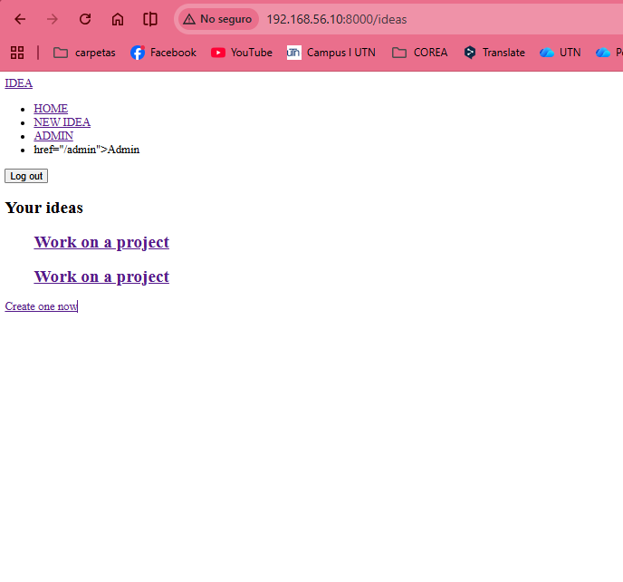
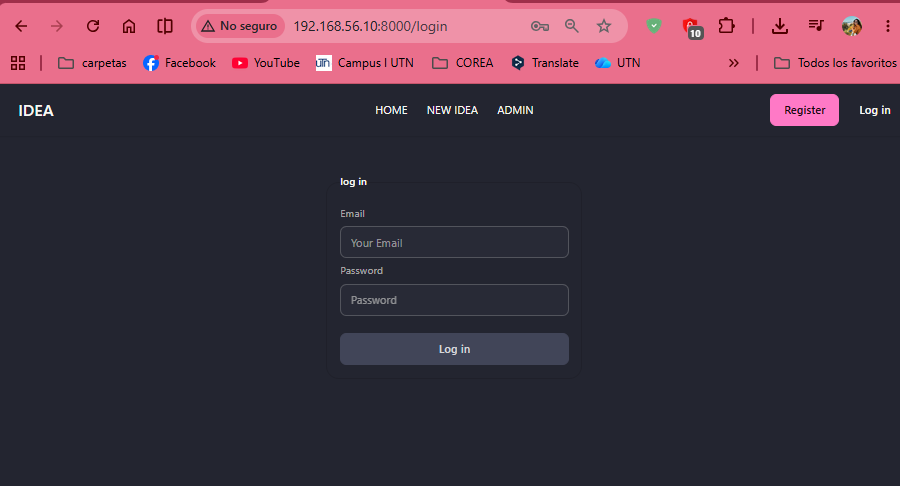

# Frontend Asset Bundling with Vite

## Episodio 19 - Frontend Asset Bundling with Vite

### Desarrollo del episodio

En este episodio aprendimos a reemplazar el uso de CDNs por un flujo de trabajo profesional utilizando **Vite**, el empaquetador de recursos que Laravel incluye por defecto. En lugar de cargar Tailwind CSS y DaisyUI desde Internet, ambos se instalan localmente y se compilan junto con los archivos CSS y JavaScript de la aplicación.

El primer paso consiste en eliminar las referencias a los CDNs de Tailwind y DaisyUI del archivo de diseño principal. Al hacerlo, la aplicación pierde completamente sus estilos, demostrando que ahora será Vite quien se encargará de suministrarlos.

Posteriormente se revisa el archivo `vite.config.js`, donde Laravel ya incluye la configuración básica para trabajar con Vite. Este archivo define cuáles serán los puntos de entrada de la aplicación (`resources/css/app.css` y `resources/js/app.js`) y habilita la recarga automática del navegador durante el desarrollo.

Dentro del archivo `resources/css/app.css` se analiza cómo Tailwind CSS utiliza la directiva `@source` para localizar todos los archivos Blade, JavaScript y demás recursos donde existan clases de Tailwind. Esto permite que durante la compilación únicamente se incluyan las utilidades realmente utilizadas, reduciendo considerablemente el tamaño final del CSS.

Para iniciar el entorno de desarrollo se ejecuta:

```bash
npm run dev
```

Este comando levanta el servidor de Vite, el cual permanece observando todos los cambios realizados en el proyecto y actualiza automáticamente el navegador mediante **Hot Reload**, sin necesidad de refrescar manualmente la página.

En el archivo de layout también se reemplazan las referencias a los estilos por la directiva Blade:

```blade
@vite([
    'resources/css/app.css',
    'resources/js/app.js'
])
```

Con esta directiva Laravel detecta automáticamente si la aplicación está en modo desarrollo o producción y carga los archivos correspondientes.

También se muestra cómo crear variables personalizadas de Tailwind CSS utilizando la nueva sintaxis de Tailwind 4, permitiendo generar automáticamente clases como:

- `text-primary`
- `bg-primary`
- `border-primary`

Al modificar el valor del color personalizado puede observarse cómo Vite actualiza inmediatamente la interfaz sin recargar la página.

Después se instala DaisyUI localmente mediante NPM y se importa directamente desde el archivo `app.css`, eliminando completamente la dependencia de un CDN externo.

El episodio también explica que cualquier código JavaScript propio debe colocarse dentro de:

```text
resources/js/app.js
```

Desde este archivo es posible importar librerías, crear componentes o utilizar frameworks como Vue o React, ya que Vite se encargará de empaquetar todo automáticamente.

Finalmente se presenta el comando utilizado para generar los archivos optimizados para producción:

```bash
npm run build
```

Este proceso crea los archivos compilados, minimizados y optimizados dentro del directorio:

```text
public/build/
```

Los archivos generados son los que finalmente serán enviados al navegador cuando la aplicación se despliegue en un servidor de producción.

---

## Conceptos aprendidos

- Qué es Vite y por qué Laravel lo utiliza como empaquetador de recursos.
- Diferencia entre cargar recursos mediante CDN y compilarlos localmente.
- Configuración básica del archivo `vite.config.js`.
- Uso del archivo `resources/css/app.css` como punto de entrada de Tailwind CSS.
- Optimización automática eliminando clases de Tailwind que no se utilizan.
- Uso del comando `npm run dev` para iniciar el servidor de desarrollo.
- Funcionamiento del Hot Reload de Vite.
- Uso de la directiva Blade `@vite`.
- Creación de colores personalizados mediante variables de Tailwind 4.
- Instalación local de DaisyUI utilizando NPM.
- Organización del JavaScript dentro de `resources/js/app.js`.
- Generación de archivos optimizados para producción con `npm run build`.
- Ubicación de los recursos compilados dentro de `public/build`.

## Evidencias

### Aplicación sin estilos después de eliminar las referencias a los CDNs de Tailwind y DaisyUI



### Aplicación utilizando Vite para cargar los estilos de Tailwind CSS y DaisyUI

