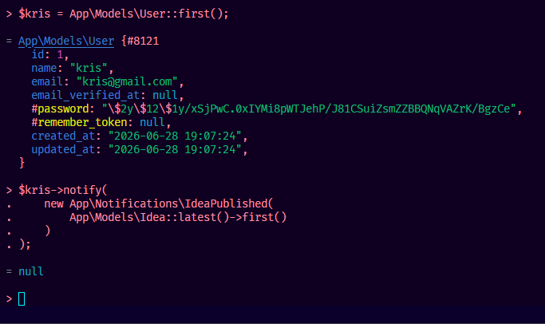
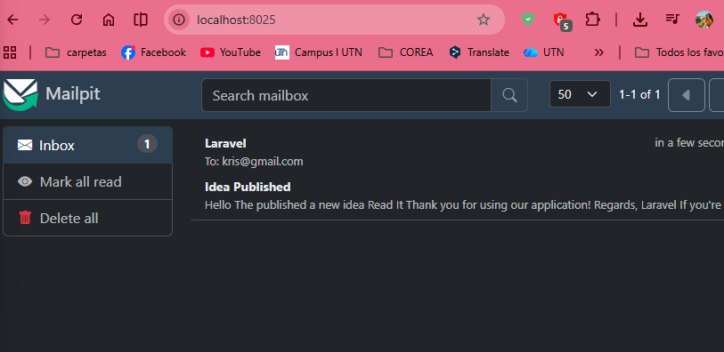
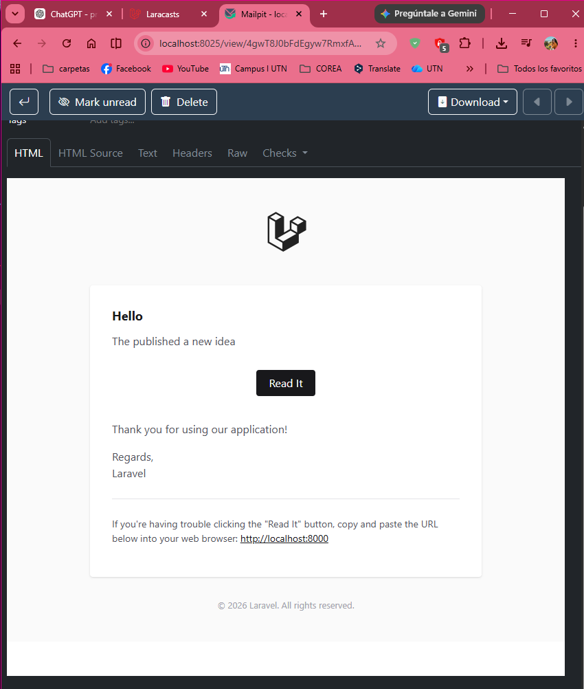

# Notifications

## Episodio 20 - Notifications

## ### Desarrollo del episodio

En este episodio se implementa el sistema de notificaciones de Laravel para avisar al usuario cuando publica una nueva idea. Laravel ya incluye soporte para notificaciones mediante el trait `Notifiable`, el cual viene agregado por defecto en el modelo `User`.

Primero se revisa el modelo `User`, donde se observa el uso del trait:

```php
use Notifiable;
```

Este trait permite utilizar métodos como `notify()`, `notifications`, `readNotifications` y `unreadNotifications`.

Luego se prueba desde Tinker el acceso a las notificaciones del primer usuario:

```php
App\Models\User::first()->notifications
```

Inicialmente esto genera un error porque todavía no existe la tabla `notifications` en la base de datos. Para solucionarlo, se genera la migración correspondiente con:

```bash
php artisan make:notifications-table
```

Después se ejecuta la migración:

```bash
php artisan migrate
```

Con esto Laravel crea la tabla `notifications`, donde se pueden almacenar las notificaciones enviadas a los usuarios.

Posteriormente se crea una nueva notificación llamada `IdeaPublished`:

```bash
php artisan make:notification IdeaPublished
```

Esto genera el archivo:

```text
app/Notifications/IdeaPublished.php
```

Dentro de esta clase se define cómo será enviada la notificación mediante el método `via()`. En el episodio se utiliza principalmente el canal `mail`, permitiendo enviar la notificación como correo electrónico.

También se configura el método `toMail()`, donde se construye el contenido del correo utilizando la clase `MailMessage`. En este método se define el saludo, el mensaje, el botón de acción y el texto final.

La notificación recibe una instancia de `Idea` mediante su constructor, para poder incluir información de la idea publicada dentro del correo.

Ejemplo general:

```php
public function __construct(public Idea $idea)
{
    //
}
```

Luego, en el controlador `IdeaController`, después de guardar una nueva idea en la base de datos, se notifica al usuario autenticado:

```php
Auth::user()->notify(
    new IdeaPublished($idea)
);
```

De esta forma, cada vez que un usuario crea una idea, Laravel envía automáticamente una notificación por correo.

Para probar los correos localmente, se utiliza Mailpit. Esta herramienta permite capturar los correos enviados por Laravel sin enviarlos realmente a Internet. Para esto se modifica la configuración del archivo `.env`:

```env
MAIL_MAILER=smtp
MAIL_HOST=127.0.0.1
MAIL_PORT=1025
MAIL_USERNAME=null
MAIL_PASSWORD=null
MAIL_ENCRYPTION=null
MAIL_FROM_ADDRESS="admin@example.com"
MAIL_FROM_NAME="${APP_NAME}"
```

Finalmente, al ejecutar Mailpit y crear una nueva idea, el correo aparece en la interfaz web de Mailpit, permitiendo revisar visualmente el contenido de la notificación.

---

## Conceptos aprendidos

- Qué son las notificaciones en Laravel.
- Uso del trait `Notifiable` en el modelo `User`.
- Diferencia entre crear una notificación y crear la tabla de notificaciones.
- Uso del comando `php artisan make:notifications-table`.
- Ejecución de migraciones con `php artisan migrate`.
- Creación de una notificación con `php artisan make:notification`.
- Uso del método `via()` para definir los canales de envío.
- Uso del canal `mail` para enviar notificaciones por correo.
- Construcción del correo mediante `MailMessage`.
- Uso del método `notify()` para enviar una notificación a un usuario.
- Pruebas de notificaciones desde Tinker.
- Configuración de Mailpit para probar correos en desarrollo.
- Integración de la notificación dentro del método `store()` del controlador.

## Evidencias

### Prueba de la notificación desde Tinker

Se envía manualmente la notificación `IdeaPublished` al primer usuario utilizando Tinker para verificar el funcionamiento del sistema de notificaciones.



### Notificación recibida en Mailpit

Mailpit captura el correo enviado por Laravel utilizando el servidor SMTP configurado para el entorno de desarrollo.



### Visualización del contenido del correo

Se verifica el diseño y contenido del correo generado por la notificación `IdeaPublished`, incluyendo el mensaje y el botón de acceso a la idea publicada.

