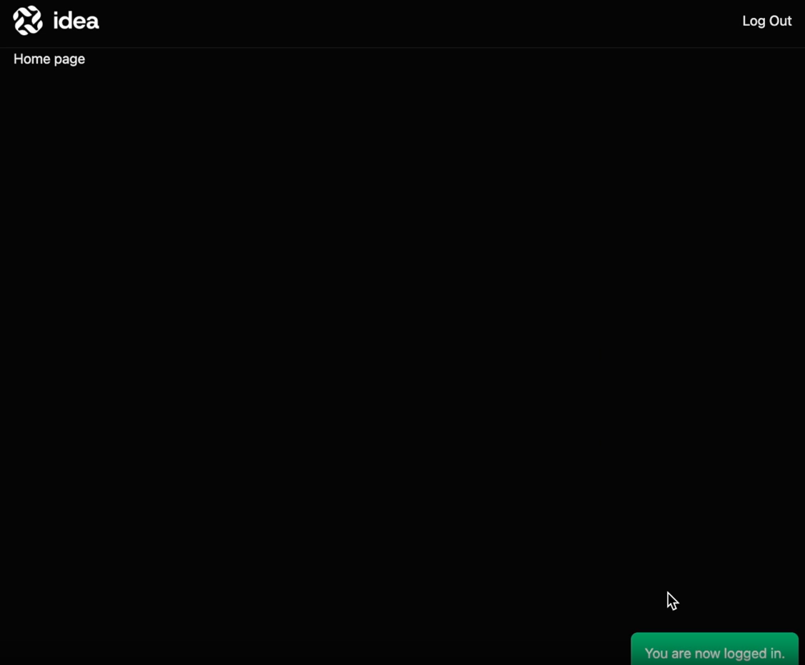

# Flash Messaging and Interactivity with AlpineJS

## Episodio 27 - Introducing Flash Messages and Interactivity with AlpineJS

### Desarrollo del episodio

En este episodio se implementó un sistema de **Flash Messages** para mostrar notificaciones temporales al usuario después de realizar acciones como iniciar sesión. Además, se introdujo **Alpine.js** para agregar interactividad sencilla a la interfaz sin necesidad de utilizar frameworks más complejos como Vue o React.

### Conceptos aprendidos

- Uso de mensajes Flash almacenados en la sesión mediante `session()->flash()`.
- Visualización de mensajes temporales utilizando la directiva `@session`.
- Personalización del estilo del mensaje mediante clases de Tailwind CSS.
- Instalación e integración de **Alpine.js** con Laravel y Vite.
- Creación de componentes interactivos utilizando:
  - `x-data`
  - `x-show`
  - `x-text`
  - `x-model`
  - `x-init`
  - `x-transition`
- Implementación de un temporizador (`setTimeout`) para ocultar automáticamente las notificaciones después de algunos segundos.
- Aplicación de animaciones de entrada y salida utilizando `x-transition`.

### Cambios realizados

#### Instalación de Alpine.js

Se agregó Alpine.js al proyecto utilizando npm:

```bash
npm install alpinejs
```

Posteriormente se inicializó dentro del archivo:

```
resources/js/app.js
```

```javascript
import Alpine from 'alpinejs';

window.Alpine = Alpine;

Alpine.start();
```

#### Flash Messages

Se implementó un mensaje de éxito utilizando la sesión:

```php
return redirect('/')
    ->with('success', 'You are now logged in.');
```

Posteriormente, en el layout principal se agregó la visualización del mensaje:

```blade
@session('success')
    <div>
        {{ $value }}
    </div>
@endsession
```

#### Estilos

El banner de notificación fue personalizado utilizando clases de Tailwind para:

- Color de fondo
- Espaciado
- Bordes redondeados
- Posición fija en la esquina inferior derecha

#### Interactividad con Alpine.js

Se creó un pequeño componente utilizando Alpine:

```html
<div
    x-data="{ show: true }"
    x-show="show"
    x-init="setTimeout(() => show = false, 3000)"
    x-transition.opacity.duration.300ms
>
    {{ $value }}
</div>
```

Este componente:

- Muestra el mensaje al cargar la página.
- Espera 3 segundos.
- Oculta automáticamente el mensaje.
- Aplica una transición suave de opacidad al desaparecer.

### Resultado

Ahora la aplicación muestra notificaciones temporales cuando una acción se realiza correctamente, ofreciendo una mejor experiencia de usuario al confirmar operaciones como el inicio de sesión sin necesidad de recargar manualmente la interfaz.

### Evidencias

#### Figura 27.1 - Flash Message con Alpine.js

Después de iniciar sesión correctamente, la aplicación muestra una notificación temporal ("You are now logged in.") ubicada en la esquina inferior derecha. El mensaje desaparece automáticamente después de unos segundos gracias a Alpine.js y las directivas `x-data`, `x-show`, `x-init` y `x-transition`.

