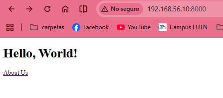
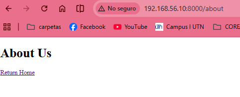

# Routing 101

## Episodio 03 - Routing 101

### Desarrollo del episodio

Durante este episodio se estudió el archivo `routes/web.php`, encargado de registrar las rutas de la aplicación Laravel.

Se analizó la ruta principal incluida por defecto al instalar Laravel:

```php
Route::get('/', function () {
    return view('welcome');
});
```

A partir de esta ruta se identificaron los siguientes conceptos:

- `Route` representa el sistema de rutas de Laravel.
- `get()` indica que la ruta responderá a solicitudes HTTP GET.
- `'/'` representa la página principal del sitio web.
- `view('welcome')` carga una vista llamada `welcome`.

Posteriormente se exploró la estructura del proyecto y se localizó la vista correspondiente dentro de:

```text
resources/views/welcome.blade.php
```

Se realizaron modificaciones al contenido de la vista para comprobar que los cambios se reflejan automáticamente en el navegador.

### Creación de enlaces entre páginas

Se agregó un enlace HTML utilizando la etiqueta `<a>` para dirigir al usuario hacia una nueva página llamada About.

Al intentar acceder a la URL `/about`, Laravel mostró un error 404 debido a que la ruta aún no había sido registrada.

### Registro de una nueva ruta

Se creó una nueva ruta utilizando:

```php
Route::get('/about', function () {
    return view('about');
});
```

También se explicó que una ruta puede retornar directamente un texto:

```php
Route::get('/about', function () {
    return 'About Us';
});
```

Aunque esta práctica no es común en aplicaciones reales, resulta útil para pruebas rápidas.

### Creación de la vista About

Se creó el archivo:

```text
resources/views/about.blade.php
```

Esta vista permitió mostrar contenido personalizado y agregar un enlace para regresar a la página principal.

### Tarea realizada

Como ejercicio práctico se registró una nueva ruta para la página Contact:

```php
Route::get('/contact', function () {
    return view('contact');
});
```

Además, se creó la vista correspondiente:

```text
resources/views/contact.blade.php
```

La página fue poblada con contenido de prueba para verificar su correcto funcionamiento.

### Archivos modificados

```text
routes/web.php
resources/views/welcome.blade.php
resources/views/about.blade.php
resources/views/contact.blade.php
```

### Conceptos aprendidos

- Sistema de rutas en Laravel.
- Solicitudes HTTP GET.
- Uso del método `Route::get()`.
- Carga de vistas mediante la función `view()`.
- Organización de archivos Blade dentro de `resources/views`.
- Manejo de errores 404 cuando una ruta no existe.
- Navegación entre páginas mediante enlaces HTML.

### Resultado obtenido

Se logró comprender la relación entre rutas y vistas dentro de Laravel. La aplicación quedó configurada con páginas Home, About y Contact funcionales, permitiendo navegar entre ellas mediante enlaces definidos por el desarrollador.

### Evidencia




