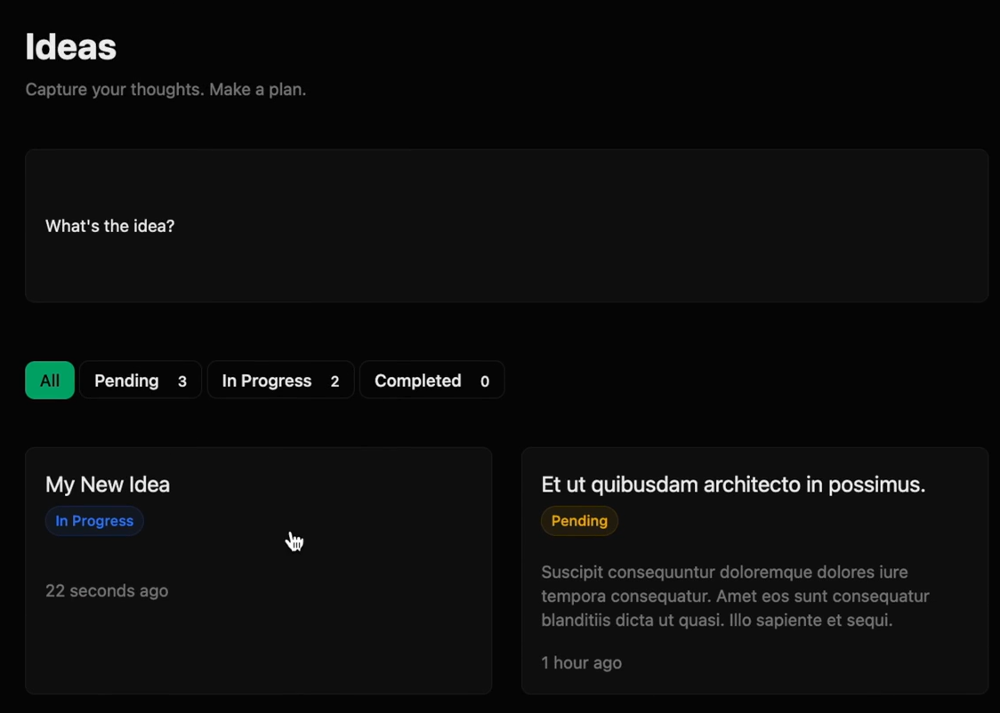

# Construct The Idea Form

## Episodio 32 - Construct The Idea Form

### Desarrollo del episodio

En este episodio se construyó el formulario para crear nuevas ideas dentro de un modal utilizando Alpine.js y componentes Blade. Además, el formulario se conectó con el controlador para almacenar la información en la base de datos mediante una petición `POST`. :contentReference[oaicite:0]{index=0}

### Creación de la ruta para almacenar ideas

Se agregó una nueva ruta que recibe la información enviada por el formulario.

```php
Route::post('/ideas', [IdeaController::class, 'store'])
    ->middleware('auth')
    ->name('ideas.store');
```

La ruta quedó protegida para que únicamente los usuarios autenticados puedan crear nuevas ideas.

### Construcción del formulario

Dentro del modal se creó un formulario con:

- Método `POST`.
- Protección CSRF.
- Envío hacia la acción `store`.

```blade
<form method="POST" action="{{ route('ideas.store') }}">
    @csrf
</form>
```

### Mejoras al modal

Se realizaron varios ajustes visuales al modal:

- Se aumentó el ancho máximo.
- Se limitó la altura al 80% de la pantalla.
- Se habilitó el desplazamiento cuando el contenido supera el espacio disponible.
- Se añadió una sombra para mejorar la apariencia.
- Se agregó un botón **X** para cerrar el modal.

### Reutilización del componente `x-form.field`

Se utilizó el componente Blade creado anteriormente para construir los campos del formulario.

Ejemplo del campo para el título:

```blade
<x-form.field
    label="Title"
    name="title"
    placeholder="Enter an idea title"
    required
/>
```

### Soporte para Textarea

El componente `x-form.field` fue actualizado para admitir un nuevo tipo de campo:

```blade
type="textarea"
```

Cuando el tipo es `textarea`, el componente genera automáticamente un `<textarea>` en lugar de un `<input>`.

Esto permitió crear el campo de descripción reutilizando el mismo componente.

### Selector personalizado para el estado

En lugar de utilizar un `<select>`, se implementó un selector mediante botones utilizando Alpine.js.

Su funcionamiento consiste en:

- Mostrar los estados disponibles.
- Actualizar el estado seleccionado cuando el usuario hace clic.
- Guardar el valor mediante un campo oculto.

```blade
<input
    type="hidden"
    name="status"
    x-model="selectedStatus"
/>
```

Los botones cambian automáticamente de estilo para indicar cuál se encuentra seleccionado.

### Integración con Alpine.js

El formulario pasó a ser un componente Alpine utilizando:

```html
x-data
```

Gracias a ello fue posible:

- Mantener el estado seleccionado.
- Aplicar clases dinámicas.
- Escuchar eventos.
- Cerrar el modal.
- Actualizar automáticamente el valor del campo oculto.

### Componente para errores de validación

Se creó un componente independiente para mostrar los errores de validación.

```blade
<x-form.error name="title" />
```

Esto evita repetir el mismo código en cada campo del formulario.

### Botones del formulario

Se agregaron dos acciones principales:

- **Cancel**
  - Cierra el modal.
  - Dispara un evento para ocultarlo.

- **Create**
  - Envía el formulario al servidor.

### Validación del lado del cliente

El campo del título fue marcado como obligatorio mediante:

```blade
required
```

De esta manera el navegador impide enviar el formulario mientras el título permanezca vacío.

### Validación mediante Form Request

Se habilitó la autorización del `StoreIdeaRequest` cambiando:

```php
return false;
```

por:

```php
return true;
```

Posteriormente se agregaron las reglas de validación para:

- Título obligatorio.
- Descripción opcional.
- Estado obligatorio y válido.

### Almacenamiento de la idea

Después de validar la información, la nueva idea se creó asociándola automáticamente al usuario autenticado.

```php
$request->user()
    ->ideas()
    ->create($request->validated());
```

Al finalizar el proceso se redirige al listado de ideas mostrando un mensaje de éxito.

### Ordenamiento de las ideas

Finalmente, el listado fue modificado para mostrar primero las ideas más recientes utilizando el campo `created_at`.

Con este cambio, cada nueva idea aparece inmediatamente en la parte superior de la lista.

---

## Conceptos aprendidos

- Creación de formularios dentro de modales.
- Rutas `POST` para almacenar información.
- Protección CSRF.
- Reutilización de componentes Blade.
- Componentes dinámicos con Alpine.js.
- Soporte para `textarea` en componentes reutilizables.
- Uso de campos ocultos (`hidden`) enlazados con Alpine.
- Aplicación de clases dinámicas mediante `:class`.
- Validación HTML con `required`.
- Validación utilizando Form Requests.
- Creación de registros asociados al usuario autenticado.
- Componentes reutilizables para mostrar errores.
- Redirecciones con mensajes Flash.
- Ordenamiento de resultados utilizando `created_at`.

---

### Evidencia


