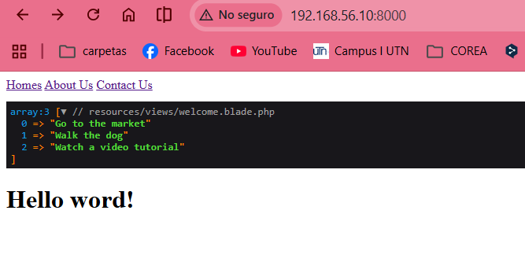
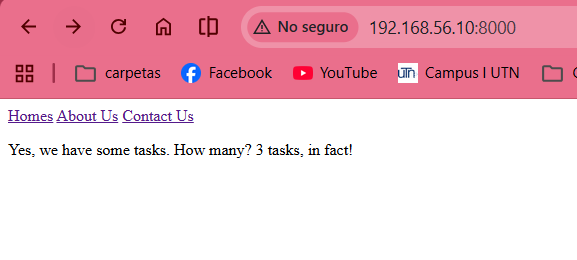

# Blade Directives

## Episodio 06: Blade Directives

### Desarrollo del episodio

En este episodio aprendí a utilizar las directivas de Blade para simplificar la escritura de código dentro de las vistas de Laravel. Blade permite reemplazar estructuras tradicionales de PHP por una sintaxis más limpia, legible y fácil de mantener.

Se trabajó con arreglos enviados desde las rutas hacia las vistas y se utilizaron herramientas de depuración como `@dump` y `@dd` para inspeccionar el contenido de las variables durante el desarrollo.

También se estudiaron las directivas condicionales `@if` y `@unless`, las cuales permiten mostrar contenido dependiendo de ciertas condiciones sin necesidad de escribir bloques extensos de PHP.

Posteriormente se utilizó `@foreach` para recorrer arreglos y mostrar elementos dinámicamente en la vista. Además, se aprendió el uso de `@forelse`, una directiva que permite recorrer una colección y mostrar un mensaje alternativo cuando no existen elementos disponibles.

Finalmente se presentó una introducción a otras directivas de Blade relacionadas con autenticación y autorización, las cuales permiten mostrar u ocultar contenido según los permisos del usuario.

### Código implementado

#### Paso de datos desde la ruta

```php
Route::get('/', function () {
    return view('welcome', [
        'tasks' => [
            'Go to the market',
            'Walk the dog',
            'Finish homework'
        ]
    ]);
});
```

#### Depuración de variables

```blade
@dump($tasks)
```

```blade
@dd($tasks)
```

#### Condicionales con Blade

```blade
@if(count($tasks))
    <p>Hay tareas disponibles.</p>
@endif
```

```blade
@unless(count($tasks))
    <p>No hay tareas activas.</p>
@endunless
```

#### Recorrido de datos

```blade
<ul>
    @foreach($tasks as $task)
        <li>{{ $task }}</li>
    @endforeach
</ul>
```

#### Manejo de arreglos vacíos

```blade
<ul>
    @forelse($tasks as $task)
        <li>{{ $task }}</li>
    @empty
        <p>No hay tareas activas.</p>
    @endforelse
</ul>
```

### Archivos modificados

- `routes/web.php`
- `resources/views/welcome.blade.php`

### Evidencia



