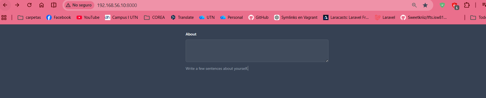
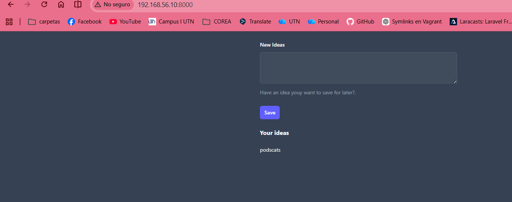

# Forms

## Episodio 07: Starting Form Handling

### Desarrollo del episodio

En este episodio se introdujo el manejo de formularios en Laravel. Se creó una aplicación sencilla para registrar ideas mediante un formulario y almacenarlas temporalmente utilizando sesiones. Además, se explicó la importancia de las solicitudes POST, la protección CSRF y el flujo completo desde que el usuario envía datos hasta que estos se muestran nuevamente en pantalla.

## Conceptos aprendidos

- Creación de formularios HTML dentro de vistas Blade.
- Uso de Tailwind CSS para mejorar la apariencia del formulario.
- Diferencia entre solicitudes GET y POST.
- Registro de rutas POST en Laravel.
- Protección contra ataques CSRF mediante la directiva `@csrf`.
- Obtención de datos enviados por el usuario con `request()`.
- Almacenamiento temporal de información utilizando sesiones.
- Redirección después de procesar una solicitud.
- Visualización dinámica de información almacenada en sesión.

## Código relevante

### Formulario para registrar ideas

```php
<form method="POST" action="/ideas">
    @csrf

    <label for="idea">New Idea</label>

    <textarea
        name="idea"
        id="idea"
        rows="4"
    ></textarea>

    <button type="submit">
        Save
    </button>
</form>
```

### Ruta para mostrar la vista

```php
Route::get('/', function () {

    $ideas = session()->get('ideas', []);

    return view('ideas', [
        'ideas' => $ideas
    ]);
});
```

### Ruta para guardar una idea

```php
Route::post('/ideas', function () {

    $idea = request('idea');

    session()->push('ideas', $idea);

    return redirect('/');
});
```

### Mostrar las ideas almacenadas

```php
@if(count($ideas))
    <h2>Your Ideas</h2>

    <ul>
        @foreach($ideas as $idea)
            <li>{{ $idea }}</li>
        @endforeach
    </ul>
@endif
```

### Ruta temporal para eliminar las ideas de la sesión

```php
Route::get('/delete-ideas', function () {

    session()->forget('ideas');

    return redirect('/');
});
```

## Archivos modificados

- `routes/web.php`
- `resources/views/ideas.blade.php`

## Evidencia





