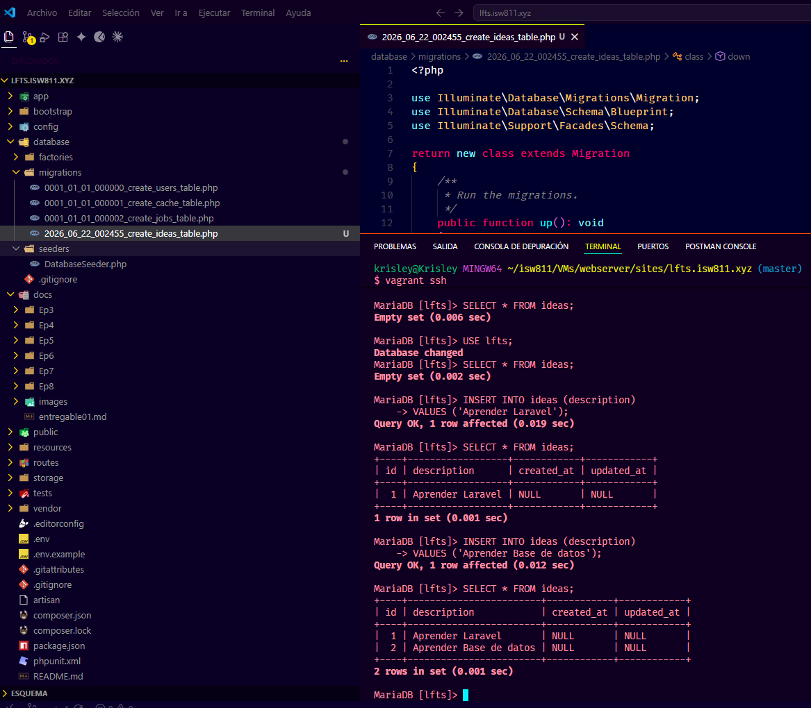
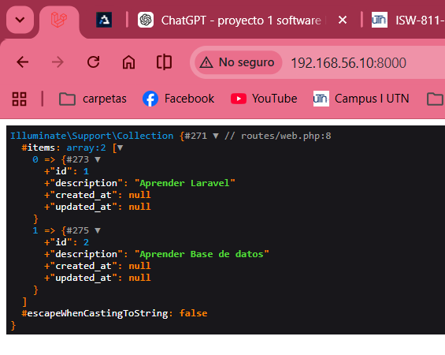

# Databases, Migrations, and Eloquent

## Episodio 08 - Databases, Migrations, and Eloquent

## Resumen

En este episodio aprendí a conectar Laravel con una base de datos y a utilizar migraciones para gestionar la estructura de las tablas. Comprendí que las migraciones funcionan como un sistema de control de versiones para la base de datos, permitiendo crear, modificar o revertir cambios de manera ordenada.

También conocí Eloquent ORM, la herramienta de Laravel para interactuar con los datos utilizando modelos en lugar de escribir consultas SQL manualmente.

## Comandos utilizados

```bash
php artisan make:migration create_ideas_table
php artisan migrate
php artisan make:model Idea
php artisan migrate:refresh
```

## Archivos modificados

- database/migrations/xxxx_xx_xx_create_ideas_table.php
- database/migrations/xxxx_xx_xx_add_state_to_ideas_table.php
- app/Models/Idea.php
- routes/web.php
- resources/views/ideas/index.blade.php

## Aspectos aprendidos

### Creación de migraciones

Se creó una migración para generar la tabla `ideas`, definiendo los campos necesarios para almacenar la información.

```php
Schema::create('ideas', function (Blueprint $table) {
    $table->id();
    $table->text('description');
    $table->timestamps();
});
```

Posteriormente se agregó un nuevo campo llamado `state` mediante una segunda migración.

```php
$table->string('state');
```

### Uso de Eloquent

Se creó el modelo `Idea` para representar la tabla `ideas` dentro de la aplicación.

```php
$ideas = Idea::all();
```

También se aprendió a buscar registros específicos:

```php
Idea::find(1);
```

Y a crear nuevos registros:

```php
Idea::create([
    'description' => $idea,
    'state' => 'pending'
]);
```

### Filtrado de resultados

Se utilizaron consultas con condiciones para obtener únicamente los registros que cumplen ciertos criterios.

```php
Idea::where('state', 'pending')->get();
```

## Evidencias
La base de datos creada y poblada

La consulta desde Laravel/Eloquent funcionando



