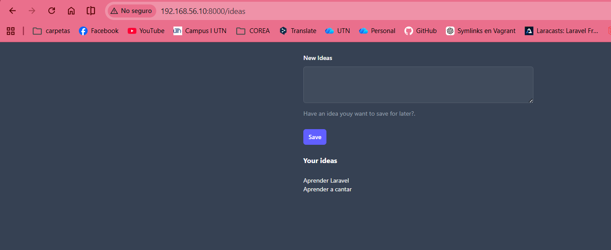
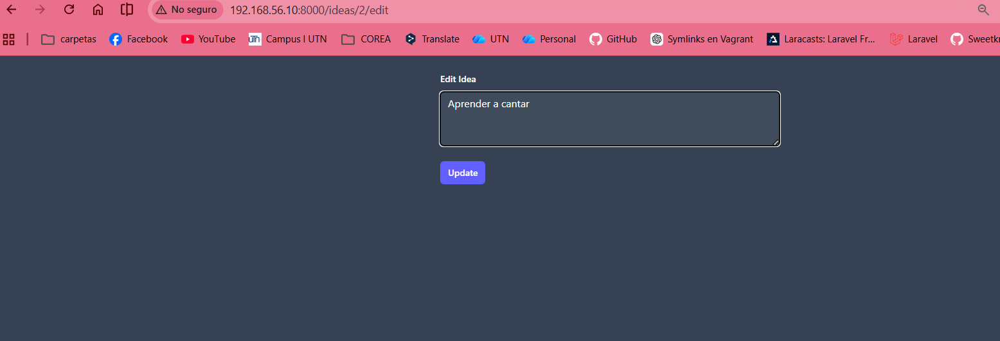
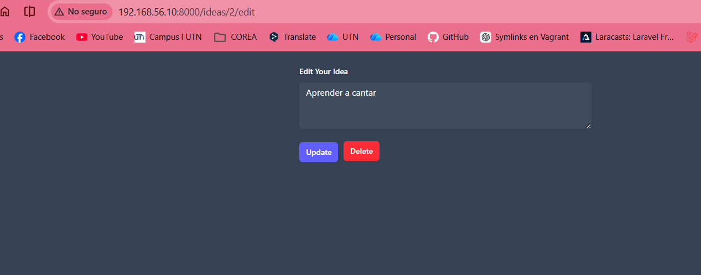

# HTTP Requests and REST

## Episodio 09: HTTP Requests and REST

### Desarrollo del episodio

En este episodio aprendí cómo Laravel utiliza el estilo arquitectónico REST para manejar recursos mediante diferentes solicitudes HTTP. Se implementaron operaciones CRUD (Crear, Leer, Actualizar y Eliminar) sobre el recurso **Ideas**, utilizando rutas, formularios y Eloquent ORM.

También comprendí la importancia de seguir convenciones REST para organizar mejor una aplicación web y mantener una estructura más limpia y fácil de entender.

## Conceptos aprendidos

### Obtener todos los registros (Index)

Se utilizó una ruta GET para recuperar todas las ideas almacenadas en la base de datos.

```php
Route::get('/ideas', function () {
    $ideas = Idea::all();

    return view('ideas.index', [
        'ideas' => $ideas
    ]);
});
```

Esta acción corresponde al método **index**, cuya función es mostrar una lista de todos los recursos disponibles.

### Mostrar un registro específico (Show)

Se creó una ruta para visualizar una idea específica utilizando su identificador.

```php
Route::get('/ideas/{idea}', function (Idea $idea) {
    return view('ideas.show', [
        'idea' => $idea
    ]);
});
```

Aquí se utilizó **Route Model Binding**, una característica de Laravel que busca automáticamente el registro correspondiente según el parámetro recibido en la URL.

### Manejo de errores con Route Model Binding

Cuando un registro no existe, Laravel devuelve automáticamente un error 404 sin necesidad de realizar validaciones manuales.

```php
Route::get('/ideas/{idea}', function (Idea $idea) {
    return view('ideas.show', [
        'idea' => $idea
    ]);
});
```

Esto simplifica considerablemente el código y mejora la experiencia del usuario.

### Editar un recurso

Se creó una vista para mostrar un formulario que permite modificar una idea existente.

```php
Route::get('/ideas/{idea}/edit', function (Idea $idea) {
    return view('ideas.edit', [
        'idea' => $idea
    ]);
});
```

Esta acción corresponde al método **edit**.

### Actualizar información (Update)

Para actualizar una idea se utilizó una solicitud PATCH.

```php
Route::patch('/ideas/{idea}', function (Request $request, Idea $idea) {
    $idea->update([
        'description' => $request->description
    ]);

    return redirect('/ideas/' . $idea->id);
});
```

Como los formularios HTML solo soportan GET y POST, Laravel utiliza **Method Spoofing** para simular solicitudes PATCH.

```html
@method('PATCH')
```

### Eliminar un recurso (Destroy)

Se implementó una ruta DELETE para eliminar registros de la base de datos.

```php
Route::delete('/ideas/{idea}', function (Idea $idea) {
    $idea->delete();

    return redirect('/ideas');
});
```

Dentro del formulario se utilizó:

```html
@method('DELETE')
```

Esto permite indicar a Laravel que la solicitud debe tratarse como un DELETE.

## Convenciones REST utilizadas

| Acción | Método HTTP | Ruta |
|----------|------------|--------|
| Index | GET | /ideas |
| Show | GET | /ideas/{idea} |
| Store | POST | /ideas |
| Edit | GET | /ideas/{idea}/edit |
| Update | PATCH | /ideas/{idea} |
| Destroy | DELETE | /ideas/{idea} |

## Archivos modificados

- routes/web.php
- resources/views/ideas/index.blade.php
- resources/views/ideas/show.blade.php
- resources/views/ideas/edit.blade.php

## Evidencias

### Evidencia 1: Página principal de ideas

Se verificó el funcionamiento de la ruta `/ideas`, donde es posible registrar nuevas ideas y visualizar todas las ideas almacenadas en la base de datos.



### Evidencia 2: Formulario de edición de una idea

Se comprobó el funcionamiento de la ruta `/ideas/{idea}/edit`, la cual carga automáticamente la información de la idea seleccionada para ser modificada.



### Evidencia 3: Actualización y eliminación de una idea

Se implementaron las acciones REST para actualizar y eliminar registros mediante los botones **Update** y **Delete**, utilizando solicitudes PATCH y DELETE respectivamente.

