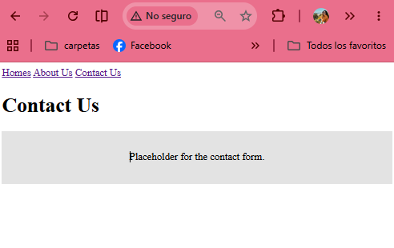

# Layout Files

## Episodio 04: Layouts y Componentes Blade

### Resumen

En este episodio aprendimos a reutilizar código en Laravel mediante el uso de componentes Blade y archivos de diseño (layouts). Inicialmente se creó una página de contacto y se agregó al menú de navegación del sitio. Posteriormente se identificó que existía mucho código repetido entre las vistas, especialmente en las etiquetas HTML, el encabezado y la navegación.

Para solucionar este problema se creó un componente de layout dentro de la carpeta `resources/views/components`, permitiendo centralizar la estructura común de todas las páginas. De esta manera, cada vista solo contiene el contenido específico de la página y el layout se encarga de mostrar los elementos compartidos.

También se aprendió el uso de la variable `$slot`, la cual permite insertar el contenido único de cada vista dentro del layout. Además, se trabajó con propiedades (props) para enviar información dinámica al componente, como el título de cada página.

Finalmente, se introdujo la diferencia entre props y atributos en los componentes Blade, así como la utilización del método `merge()` para combinar atributos personalizados con los atributos predeterminados del componente.

### Conceptos aprendidos

- Creación de componentes Blade reutilizables.
- Uso de layouts para evitar duplicación de código.
- Utilización de la variable `$slot`.
- Definición y uso de props mediante `@props`.
- Diferencia entre props y atributos HTML.
- Uso de `$attributes->merge()`.
- Simplificación de rutas mediante `Route::view()`.

### Archivos modificados

- `routes/web.php`
- `resources/views/welcome.blade.php`
- `resources/views/about.blade.php`
- `resources/views/contact.blade.php`
- `resources/views/components/layout.blade.php`
- `resources/views/components/card.blade.php`

### Evidencia

### Comentarios

Este episodio me permitió comprender la importancia de reutilizar código en Laravel. El uso de layouts y componentes facilita el mantenimiento de la aplicación, ya que los cambios en elementos comunes como la navegación o los estilos pueden realizarse en un único archivo y reflejarse automáticamente en todas las vistas.